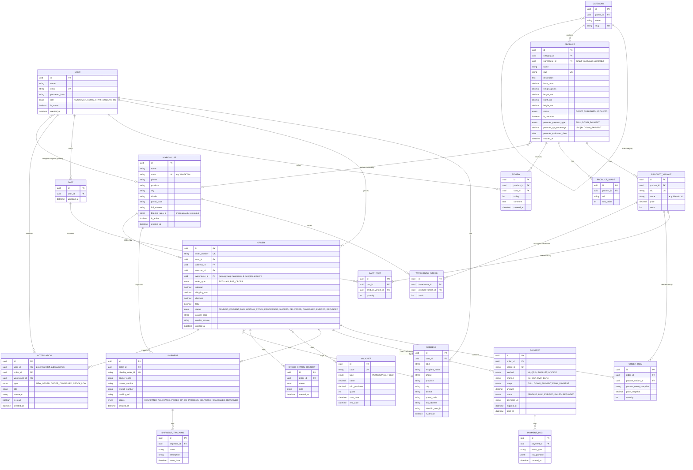

# Entity Relationship Diagram (ERD)
## Aplikasi E-Commerce Online Store

---

## 1. Diagram Relasi (Mermaid)

---

## 2. Deskripsi Entitas Kunci

| Entitas | Deskripsi |
|---|---|
| `USER` | Menyimpan customer & admin (dibedakan via `role`) |
| `ADDRESS` | Alamat pengiriman customer, menyimpan `biteship_area_id` untuk mempercepat pemanggilan Rate API |
| `PRODUCT` / `PRODUCT_VARIANT` | Produk induk & varian (ukuran/warna) dengan stok & harga masing-masing; berat/dimensi di level produk dipakai untuk hitung ongkir |
| `CART` / `CART_ITEM` | Keranjang belanja aktif per user |
| `ORDER` / `ORDER_ITEM` | Pesanan beserta snapshot harga & nama produk saat transaksi (agar histori tidak berubah jika produk diedit) |
| `ORDER_STATUS_HISTORY` | Audit trail perubahan status order |
| `PAYMENT` / `PAYMENT_LOG` | Data transaksi Xendit & log mentah webhook (untuk debugging/replay). `stage` membedakan pembayaran penuh, DP, atau pelunasan (untuk order Pre-Order) |
| `SHIPMENT` / `SHIPMENT_TRACKING` | Data pengiriman Biteship & histori tracking real-time |
| `VOUCHER` | Kupon diskon |
| `WAREHOUSE` | Data gudang (bisa banyak/multi-lokasi), dikelola Super Admin di menu **Data Gudang**; tiap gudang punya `biteship_area_id` sendiri sebagai titik asal (origin) perhitungan ongkir |
| `WAREHOUSE_STOCK` | Stok per varian produk, dipecah per gudang (menggantikan stok tunggal di `PRODUCT_VARIANT` jika multi-gudang aktif) |
| `NOTIFICATION` | Notifikasi in-app (mis. order baru masuk) yang dikirim ke staff gudang terkait saat ada order baru yang harus diproses |

---

## 3. Catatan Desain

- **Snapshot data** (`product_name_snapshot`, `price_snapshot`) dipakai di `ORDER_ITEM` supaya perubahan harga/nama produk di masa depan tidak mengubah histori order lama.
- **`PAYMENT_LOG`** dan **`SHIPMENT_TRACKING`** menyimpan raw payload webhook (`jsonb`) untuk audit & debugging idempotency.
- Semua **status** sebaiknya berupa Postgres `enum` (via Prisma `enum`) agar konsisten dan tervalidasi di level database.
- Index penting: `order_number`, `email` (unique), `sku` (unique), `xendit_id`, `biteship_order_id`.
- Relasi `ORDER -> SHIPMENT` bersifat 1-to-1 (opsional) pada MVP; bisa diubah ke 1-to-many jika mendukung multi-pengiriman per order di masa depan (split shipment).
- `ORDER -> PAYMENT` bersifat 1-to-many: order reguler/PO full payment hanya punya 1 `PAYMENT` (`stage = FULL`); order PO dengan skema DP punya 2 `PAYMENT` (`stage = DOWN_PAYMENT` lalu `FINAL_PAYMENT`).
- **Multi-gudang**: stok sebenarnya disimpan per gudang di `WAREHOUSE_STOCK` (bukan langsung di `PRODUCT_VARIANT.stock`). Field `stock` di `PRODUCT_VARIANT` bisa dijadikan kolom generated/computed (total dari semua gudang) untuk tampilan ringkas di katalog.
- Saat checkout, sistem menentukan `warehouse_id` order berdasarkan gudang dengan stok tersedia terdekat dari alamat customer (atau default 1 gudang jika toko baru punya 1 lokasi) — logika pemilihan gudang didetailkan di [SRS.md](./SRS.md) §3.12 (FR-13.4).
- Setiap order baru yang `paid` otomatis membuat baris `NOTIFICATION` untuk staff gudang yang terkait dengan `warehouse_id` order tersebut (real-time via Pusher/SSE — lihat [TECHSTACK.md](./TECHSTACK.md#8-notifikasi-real-time-order--dashboard-gudang)).
